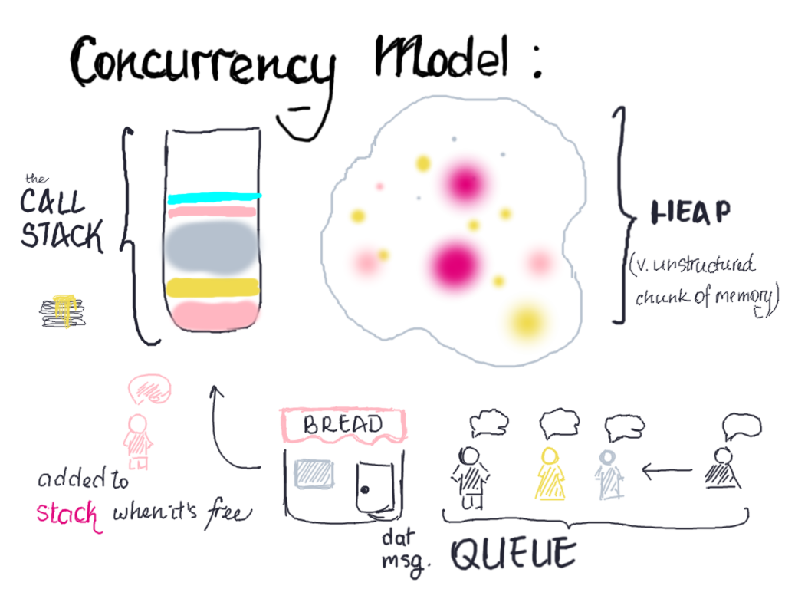
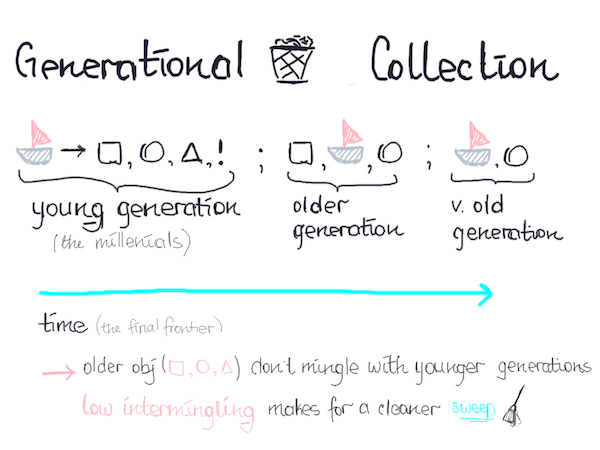

# Garbage collection in V8, an illustrated guide
This guide is unlike others I've done so far, and has a bit of a narrative to go
along with the sketches. I thought the entire concept of garbage collection and how
it gets dealt with in javascript, or more specifically in engines that run
javascript, deserves a bit more of an explanation. I would also like to mention
that this guide is meant to be beginner friendly, and does not cover every aspect
of memory management within V8, and the rest of V8 internals. I've added a bunch
of [resources](#sources), if you want to delve into it more. This guide also
focuses on ✨ javascript ✨, , obviously garbage collection is different in rust
or C.

Ok, so let's get started.

## What's v8?
V8, the javascript runtime engine, not to be confused with your fav tomato juice 🍹,
compiles and executes your beautifully written javascript. V8 comes with a generational,
stop-the-world garbage collector, which I am going to try to explain below. It
comes hand in hand together with Chrome. SpiderMonkey would be the Mozilla's
equivalent, and Chakra, Microsoft's. Basically when running javascript, you need
an engine to handle it for ya and V8 is one of your options, whether it's in the
browser or in node environment.

## What is garbage collection?
The essential point of garbage collection is the ability to manage memory usage
by a specific program. Languages such as C are generally able to hook into program's
memory management and allocate and free object within the context of the program.
ECMAScript, on the other hand, lacks that particular interface to access memory
management (yes, that means no API). Which basically means all *memory management*
rights™ in a program get passed over to V8. 

Since we don't have access to infinte amount of memory, garbage collector's job
is to go through objects that are allocated in memory and determine whether they
are *dead* or *alive*. Those that are alive get to stay in memory, those that are
dead get removed, and memory gets allocated back to the heap. 

*What's a heap though?* A heap is an unstructured region, where the objects get
allocated memory. This kind of allocation is *dynamic*, since the size /
lifetime / quantity of objects is unknown, so it needs to be allocated and
deallocated at runtime.

So if we look at the concurrency model, heap works directly with the call stack, 
as the objects showing up in the stack require memory allocation. It would look
something like this:



## Dead or alive?
The basic check for when an object is dead or alive, is whether or not the
client, or the program that executes the code, can reach it. The most reachable
object you can think of, is probably an object defined in root scope. In vanilla
dot js(vanilla.js) on the client, this would look something like this:

```js
document.addEventListener("DOMContentLoaded", function () {
  var alive = "whoa i am alive" // object in root scope && reachable
})
```
Some C++ bindings (or web APIs on the client) are also part of the root, so you
can access things like `setInterval` directly.

Reachability could also be thought of as whether or not another object or root
can get a hold of it, if it can, the memory required by that object gets kept.

## So how do we get to garbage collection even? (tell me! tell me!)
V8 allocates memory in the heap as you create new objects, or new 'pointers'.
(javascrit doesn't have real pointers, so 'pointers' are techincally just
copied references to an original object). V8 separates the heap into two
portions: one which handles your allocated memory, the other which belongs to
the garbage collector. When you perform an operations that requires V8 to
allocate memory, you end up taking up space in the first portion. As you keep
adding things to heap, you eventually run out of space, so V8 is forced to stop
everything you're doing and perform garbage collection(oh hey, that's where
*stop-the-world* is coming from. nice). The garbage collection goes through the used
portion of the heap and removes everything that is dead, or is no longer needed. 

Once only alive objects are left in the heap, the first part of the division
gets copied over to the second and the two swap spots. The garbage collection
for the round is done, and the next set of objects then have room in the memory
heap. It would look something like this: (insert heap division illustration)

V8 divides objects into two generations: young (those millenials) and older.



Older objects are the ones that survived more than one garbage sweep, meaning
they keep being referenced by other objects and still need that memory allocation.
They normally don't reference younger objects, but do reference older ones. The
lack if intergenerational intermingling makes for a cleaner sweep with each
collection.

## 🆒 sources.js
- [memory management](http://www.memorymanagement.org/); i like reading through
the [glossary](http://www.memorymanagement.org/glossary/) section, cause you
discover a bunch of neat stuff.
- this is a really good and [v detailed repo](https://github.com/thlorenz/v8-perf)
on v8's perf.
- you can look into [v8 repo's wiki](https://github.com/v8/v8/wiki) for more
internal information and how to work with v8 to debug your projects.
- on frame rates from [firefox dev tools](https://developer.mozilla.org/en-US/docs/Tools/Performance/Frame_rate)
