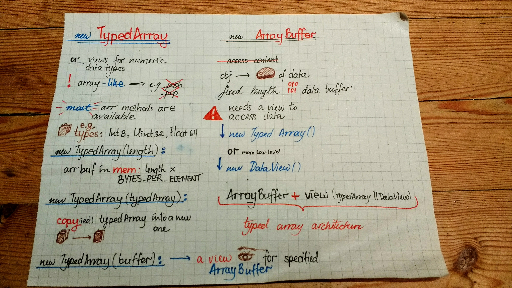

A sketchnote on typed arrays in javascript!

Resources:

[js && typed arrays](https://developer.mozilla.org/en-US/docs/Web/JavaScript/Typed_arrays)
[ArrayBuffer](https://developer.mozilla.org/en-US/docs/Web/JavaScript/Reference/Global_Objects/ArrayBuffer)
[TypedArray](https://developer.mozilla.org/en-US/docs/Web/JavaScript/Reference/Global_Objects/TypedArray)
[DataView](https://developer.mozilla.org/en-US/docs/Web/JavaScript/Reference/Global_Objects/DataView)
