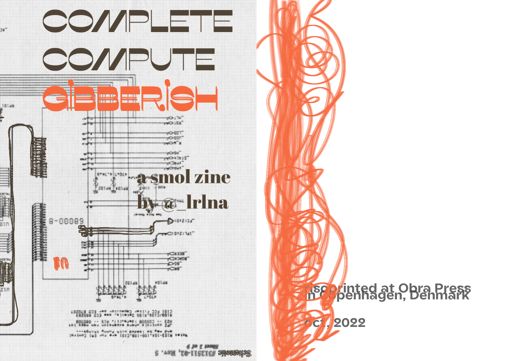
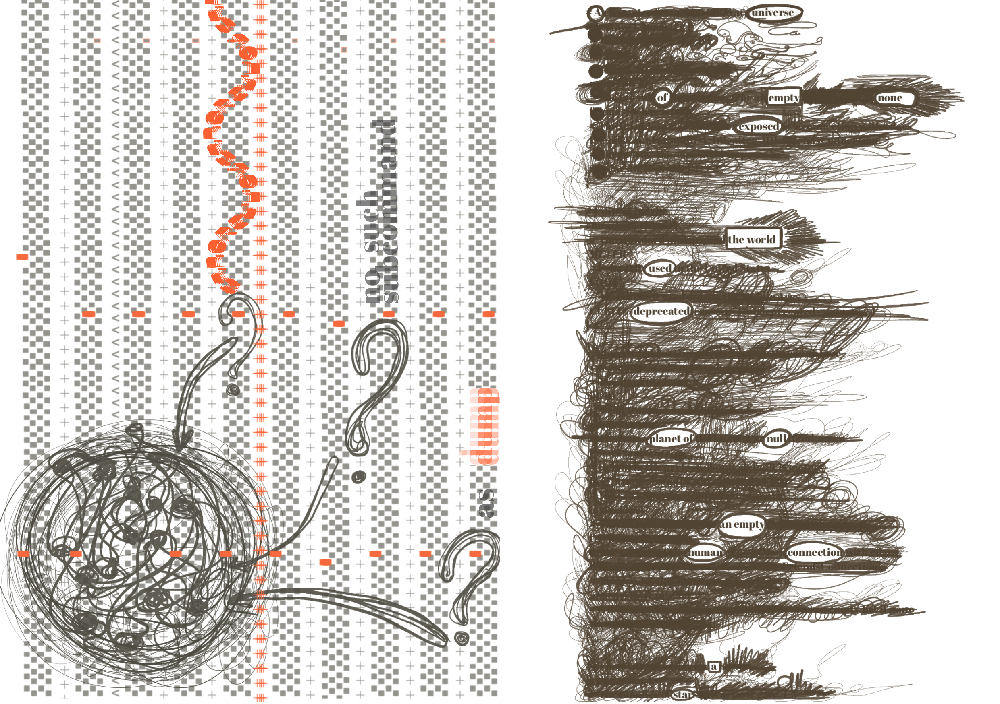
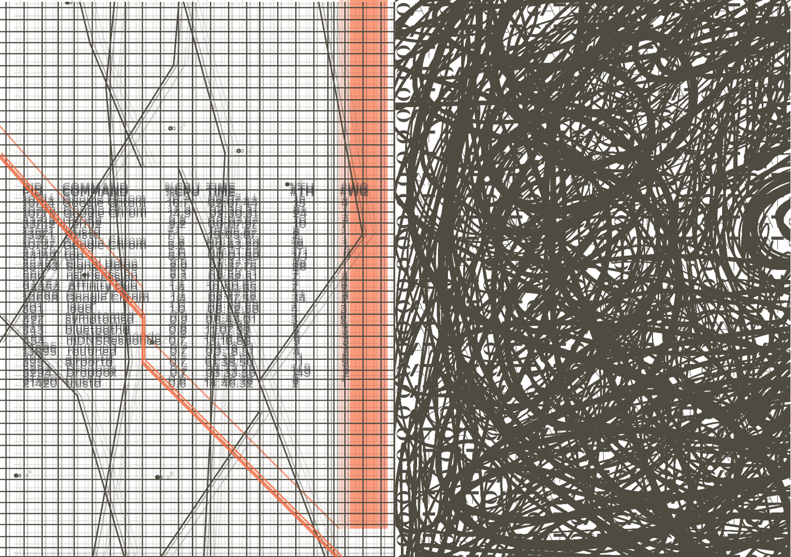
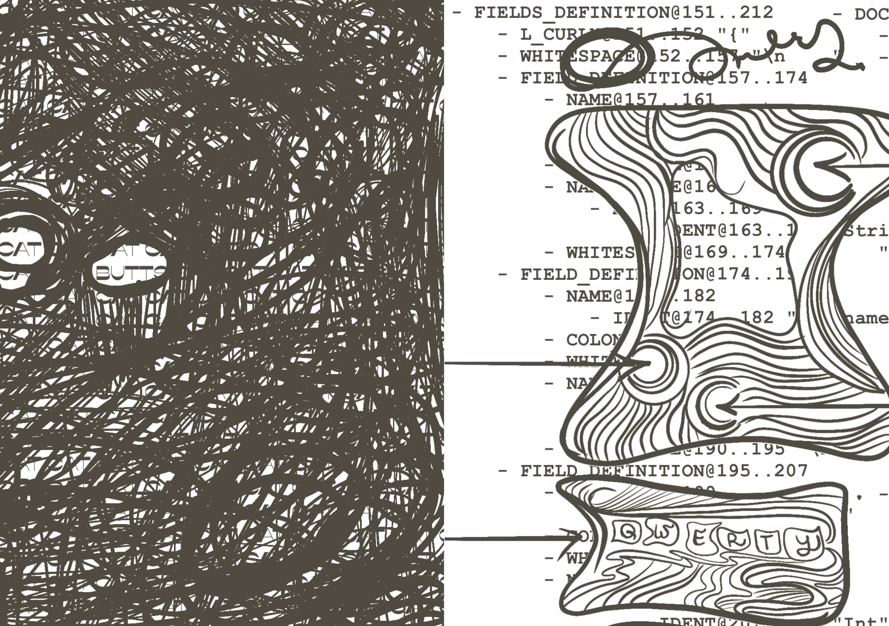
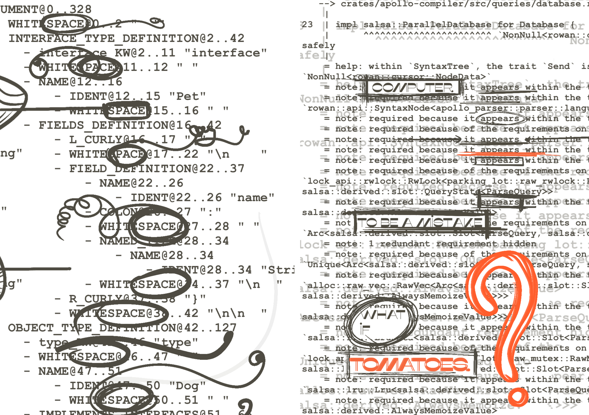
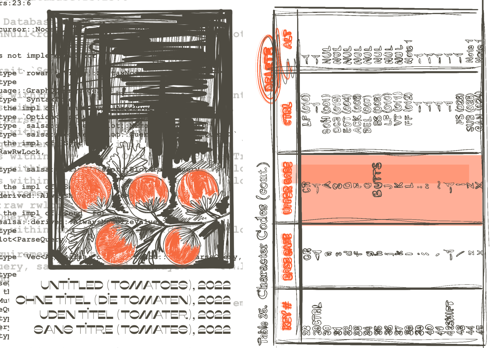
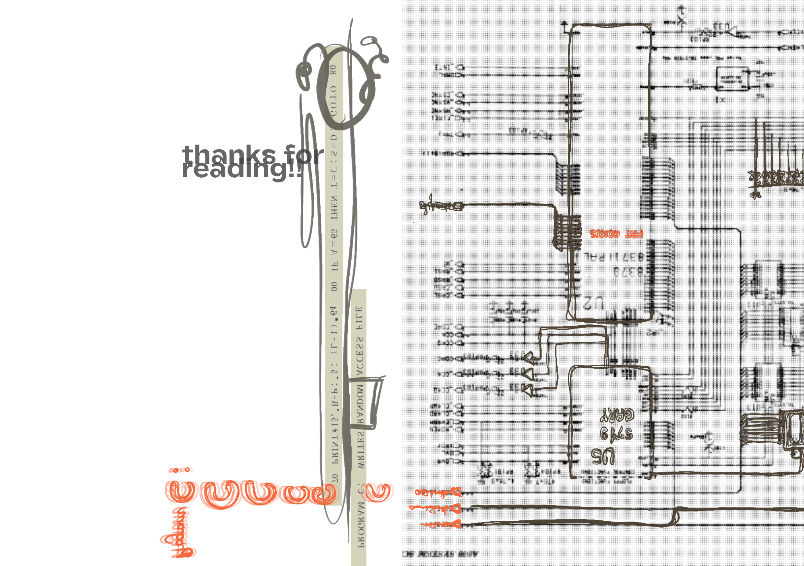

## Complete Compute Gibberish

This is more of an art zine than an instructional zine. I put together from various bits and bobs I drew for my [rust conf 2022 talk](https://www.youtube.com/watch?v=ZJbofN7eg6E&t=1788s).

The zine was made to be printed with a riso printer, but you can also print it
at home on a regular printer. I added a [PDF](./img/complete-compute-gibberish/2022-09-22%20complete%20compute%20gibberish%20a6%20book.pdf) for those who are interested. 

