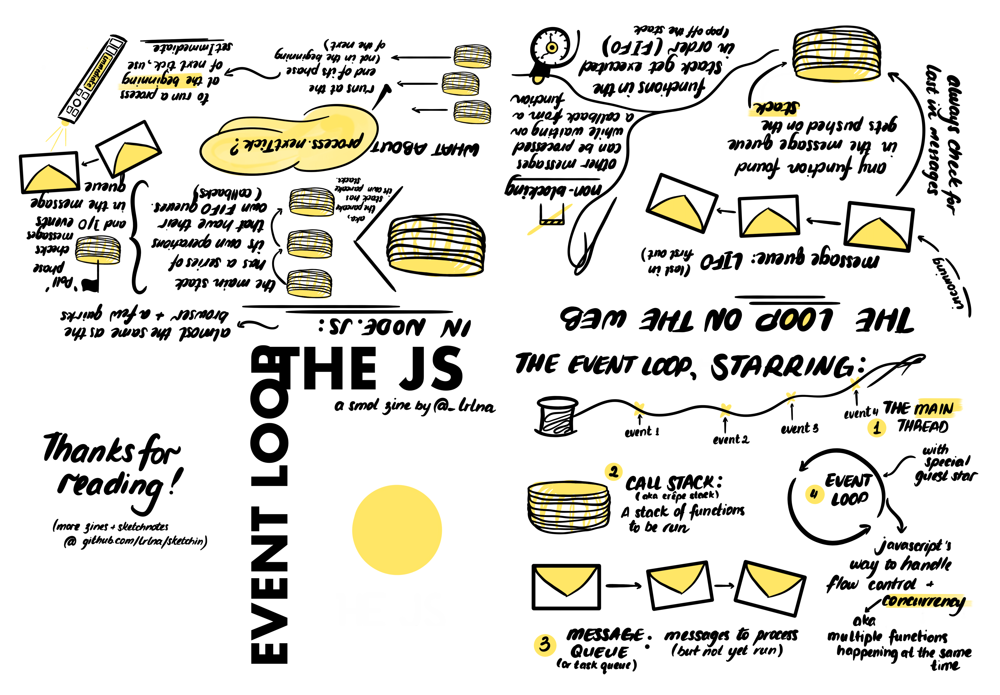

## Event Loop in JS and Node.js

A very smol and informative zine on Event Loop. No, the microtask queue is omitted in this one, only 6 pages to draw mates.

More reading material:
- [Event Loop and Microtasks](https://jakearchibald.com/2015/tasks-microtasks-queues-and-schedules/)
- [Event Loop in Node.js](https://nodejs.org/en/docs/guides/event-loop-timers-and-nexttick/)

Printing instructions are [here](./instructions.md).

_EDIT:_ The original version had Message Queue listed as LIFO (Last In First Out), and the Call Stack listed as FIFO (First In First Out). This is indeed wrong. Message Queue is in fact *FIFO*, and the Call Stack if *LIFO*.

